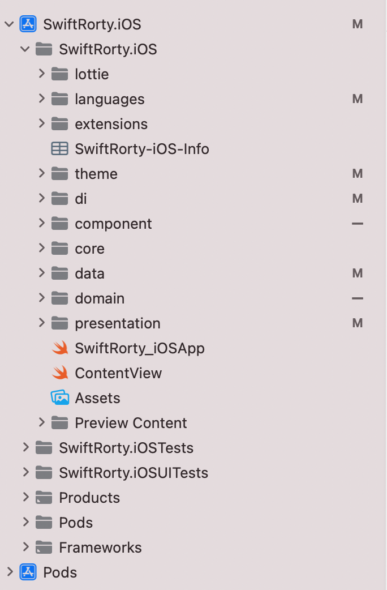
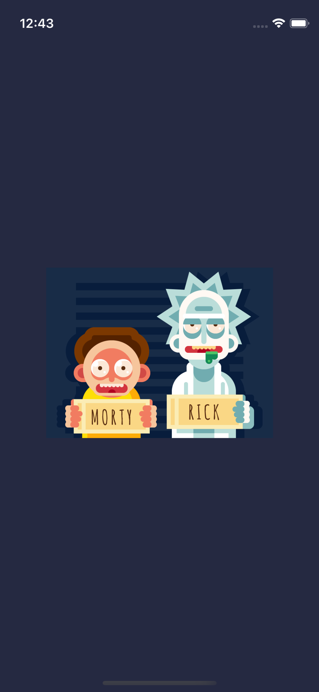
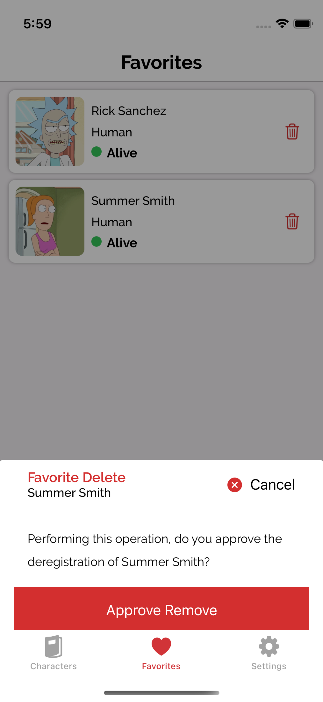

[](https://github.com/realm/SwiftLint)


[](https://tuist.io)
[](https://opensource.org/licenses/Apache-2.0)

<p align="center"> 
    
</p>

<h1 align="center"> Swift-UI Rorty iOS </h1>

iOS Clean Architecture in Rorty is a sample project that presents modern, approach to [iOS](https://developer.apple.com/) application development 
using [Swift](https://developer.apple.com/swift/) and latest tech-stack.

The goal of the project is to demonstrate best practices, provide a set of guidelines, and present modern Swift-UI
application architecture that is modular, scalable, maintainable and testable. This application may look simple, but it
has all of these small details that will set the rock-solid foundation of the larger app suitable for bigger teams and
long application lifecycle management.

An iOS app built using Swift that consumes [Rick and Morty API](https://rickandmortyapi.com) to display characters, episodes, location from 
the [TV Series](https://www.imdb.com/title/tt2861424/). It has been built following Clean Architecture Principle, Repository Pattern, MVVM Architecture 
in the presentation layer as well as Swift UI components.

## Architecture
A well planned architecture is extremely important for an app to scale and all architectures have one common goal- to manage complexity of your app. This isn't something to be worried about in smaller apps however it may prove very useful when working on apps with longer development lifecycle and a bigger team.

Clean architecture was proposed by [Robert C. Martin](https://en.wikipedia.org/wiki/Robert_C._Martin) in 2012 in the [Clean Code Blog](http://blog.cleancoder.com/uncle-bob/2012/08/13/the-clean-architecture.html) and it follow the SOLID principle.

<p align="center"></p>

The circles represent different layers of your app. Note that:

- The center circle is the most abstract, and the outer circle is the most concrete. This is called the [Abstraction Principle](https://en.wikipedia.org/wiki/Abstraction_principle_(computer_programming)). The Abstraction Principle specifies that inner circles should contain business logic, and outer circles should contain implementation details.

- Another principle of Clean Architecture is the [Dependency Inversion](https://en.wikipedia.org/wiki/Dependency_inversion_principle). This rule specifies that each circle can depend only on the nearest inward circle ie. low-level modules do not depend on high-level modules but the other way around.

<p align="center"></p>

### Why Clean Architecture?
- ```Loose coupling between the code``` - The code can easily be modified without affecting any or a large part of the app's codebase thus easier to scale the application later on.
- Easier to ```test``` code.
- ```Separation of Concern``` - Different modules have specific responsibilities making it easier for modification and maintenance.

### S.O.L.I.D Principles

- [__Single Responsibility__](https://en.wikipedia.org/wiki/Single-responsibility_principle): Each software component should have only one reason to change – one responsibility.

- [__Open-Closed__](https://en.wikipedia.org/wiki/Open%E2%80%93closed_principle#:~:text=In%20object%2Doriented%20programming%2C%20the,without%20modifying%20its%20source%20code.): You should be able to extend the behavior of a component, without breaking its usage, or modifying its extensions.

- [__Liskov Substitution__](https://en.wikipedia.org/wiki/Liskov_substitution_principle): If you have a class of one type, and any subclasses of that class, you should be able to represent the base class usage with the subclass, without breaking the app.

- [__Interface Segregation__](https://en.wikipedia.org/wiki/Interface_segregation_principle): It’s better to have many smaller interfaces than a large one, to prevent the class from implementing the methods that it doesn’t need.

- [__Dependency Inversion__](https://en.wikipedia.org/wiki/Dependency_inversion_principle): Components should depend on abstractions rather than concrete implementations. Also higher level modules shouldn’t depend on lower level modules.

## Layers

### Project Structure
<p align="center"></p>

### Component
The ```component``` layer is responsible for common view components that using app.

### Core
The ```core``` layer is contains different utilities that can be used by the different modules and base structures.

### Data
The ```data``` layer is responsible for selecting the proper data source for the domain layer. It contains the implementations of the repositories declared in the domain layer.

Components of data layer include:
- __model__

  -__dto__: Defines dto of ui model, also perform data transformation between ```domain```, ```response``` and ```entity``` models.

  -__local__: Defines the schema of SQLite database.

  -__remote__: Defines POJO of network responses.

- __local__: This is responsible for performing caching operations using [Room](https://developer.android.com/training/data-storage/room).

- __remote__: This is responsible for performing network operations eg. defining API endpoints using [Retrofit](https://square.github.io/retrofit/).

- __repository__: Responsible for exposing data to the domain layer.

### Domain
This is the core layer of the application. The ```domain``` layer is independent of any other layers thus ] domain business logic can be independent from other layers.This means that changes in other layers will have no effect on domain layer eg.  screen UI (presentation layer) or changing database (data layer) will not result in any code change withing domain layer.

Components of domain layer include:
- __usecase__: They enclose a single action, like getting data from a database or posting to a service. They use the repositories to resolve the action they are supposed to do. They usually override the operator ```invoke``` , so they can be called as a function.

### Presentation
The ```features``` layer contains components involved in showing information to the user. The main part of this layer are the views(activity, compose) and ViewModels.

## Demo Screenshots

| Mode  | Splash                                                   | Characters                                                 | Character Favorite                                        |
|-------|----------------------------------------------------------|------------------------------------------------------------|-----------------------------------------------------------|
| Light |        |      |      |
| Dark  |        | | |

| Mode  | Character Detail                                         | Settings                                                   |
|-------|----------------------------------------------------------|------------------------------------------------------------|
| Light |        |        |
| Dark  |   |   |

# Tech Stacks
This project uses many of the popular libraries, plugins and tools of the android ecosystem.

- [MVVM](https://en.wikipedia.org/wiki/Model%E2%80%93view%E2%80%93viewmodel) - the viewmodel is responsible for exposing (converting) the data objects from the model in such a way that objects are easily managed and presented..
- [Resolver](https://github.com/hmlongco/Resolver) - Dependency Injection library.
- [Combine](https://developer.apple.com/documentation/combine) - Customize handling of asynchronous events by combining event-processing operators.
- [Core Data](https://developer.apple.com/documentation/coredata) - Persist or cache data on a single device, or sync data to multiple devices with CloudKit.
- [Lottie](https://lottiefiles.com/blog/working-with-lottie/how-to-add-lottie-animation-ios-app-swift) - JSON-based animation file format that enables designers to ship animations on any platform as easily as shipping static assets.
- [Paging](https://developer.apple.com/documentation) - The Paging Library makes it easier for you to load data gradually and gracefully within your app's List.
- [Tuist](https://tuist.io/) - Tuist is a command line tool (CLI) that aims to facilitate the generation, maintenance, and interaction with Xcode projects.

### Code Analyze Tools
- [SwiftLint](https://github.com/realm/SwiftLint) - A tool to enforce Swift style and conventions.

## 🚀 Posts In Medium
[Article](https://developersancho.medium.com/)


## 🤝 Contributing

Contributions are what make the open source community such an amazing place to be learn, inspire,
and create. Any contributions you make are **greatly appreciated**.

1. Open an issue first to discuss what you would like to change.
2. Fork the Project
3. Create your feature branch (`git checkout -b feature/amazing-feature`)
4. Commit your changes (`git commit -m 'Add some amazing feature'`)
5. Push to the branch (`git push origin feature/amazing-feature`)
6. Open a pull request

Please make sure to update tests as appropriate.

## ✍️ Authors

<a href="https://www.linkedin.com/in/mesut-g-33b41030" target="_blank">
  
</a>

👤 **developersancho**

[](https://www.linkedin.com/in/mesut-g-33b41030/)
[](https://developersancho.medium.com/)

Feel free to ping me 😉

## License

```license
Copyright © 2022 - developersancho

Licensed under the Apache License, Version 2.0 (the "License");
you may not use this file except in compliance with the License.
You may obtain a copy of the License at

   http://www.apache.org/licenses/LICENSE-2.0

Unless required by applicable law or agreed to in writing, software
distributed under the License is distributed on an "AS IS" BASIS,
WITHOUT WARRANTIES OR CONDITIONS OF ANY KIND, either express or implied.
See the License for the specific language governing permissions and
limitations under the License.
```
